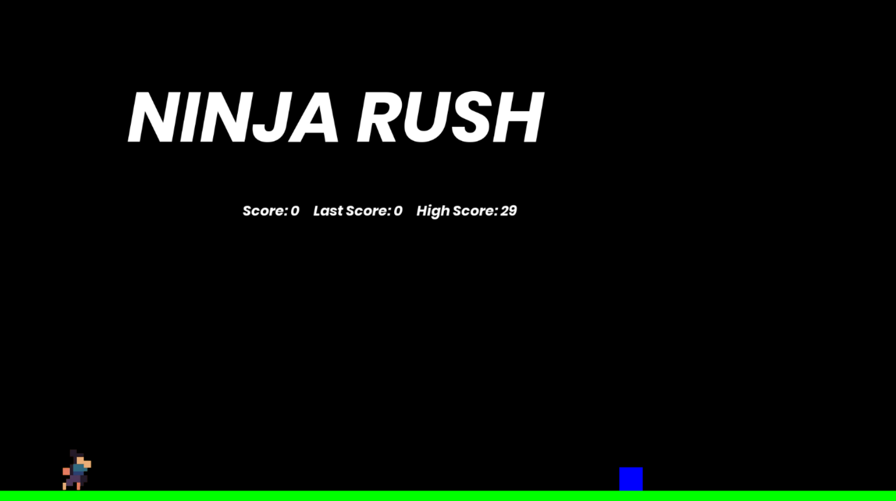

# Ninja Rush

## Overview

**Ninja Rush** is a 2D endless runner game developed in **C++** using the **SFML (Simple and Fast Multimedia Library)**. In this game, the player controls a ninja character who must jump over incoming obstacles to survive and achieve the highest possible score. As the game progresses, the obstacles move faster, making the gameplay increasingly challenging.

This project was developed as a first-semester programming project to demonstrate the practical implementation of programming concepts such as graphics rendering, event handling, collision detection, randomization, and file handling.


**Please wait a few seconds, the demo GIF is loading...**

---

# Features

* Ninja character controlled by the player
* Jumping mechanics
* Randomly generated obstacles with different sizes
* Random obstacle colors
* Dynamic difficulty progression
* Real-time score display
* High score tracking using file storage
* Fullscreen gameplay
* Frame rate limited to 60 FPS for smooth performance

---

# Technologies Used

* **Programming Language:** C++
* **Graphics Library:** SFML (Simple and Fast Multimedia Library)
* **Compiler:** GNU GCC Compiler
* **IDE:** Code::Blocks / Visual Studio Code
* **Operating System:** Windows

---

# Libraries Used

```cpp
#include <SFML/Graphics.hpp>
#include <iostream>
#include <fstream>
#include <sstream>
#include <string>
```

## Purpose of Libraries

### SFML/Graphics.hpp

Used for:

* Window creation
* Graphics rendering
* Sprite management
* Text rendering
* Event handling

### iostream

Used for standard input and output operations.

### fstream

Used for reading and writing score data to files.

### sstream

Used for converting between strings and numeric values.

### string

Used for string manipulation and storage.

---

# Game Controls

| Key      | Function      |
| -------- | ------------- |
| Up Arrow | Jump          |
| Escape   | Exit the game |

---

# Game Logic

1. The ninja starts on the ground.
2. Press the **Up Arrow** key to make the ninja jump.
3. Obstacles continuously move toward the player.
4. Successfully avoiding an obstacle increases the score.
5. After every few points, the obstacle speed and game difficulty increase.
6. If the ninja collides with an obstacle, the game ends.
7. The current score is saved to `score.txt`, and the highest previous score is displayed.

---

# Project Objectives

The objectives of this project are:

* To develop an interactive endless runner game.
* To apply object-oriented and procedural programming concepts.
* To implement collision detection between game objects.
* To use randomization for dynamic obstacle generation.
* To store and retrieve high scores using file handling.
* To gain practical experience with the SFML graphics library.

---

# Folder Structure

```
Ninja Rush/
│
├── main.cpp
├── guy.png
├── bold.ttf
├── score.txt
└── README.md
```

---

# Screenshot

---

# Future Improvements

The project can be further enhanced by adding:

* Background music and sound effects
* Animated backgrounds
* Multiple obstacle types
* Power-ups and collectibles
* Lives or health system
* Pause and restart menu
* Online leaderboard
* Character animations
* Additional player actions such as sliding or ducking

---

# Learning Outcomes

This project provided practical experience in:

* C++ programming
* SFML graphics programming
* Game development fundamentals
* Collision detection techniques
* File handling
* Event-driven programming
* Problem-solving and debugging

---

# Author

**Muhammad Adil**

Bachelor of Science in Computer Science (BSCS)

First Semester Project
